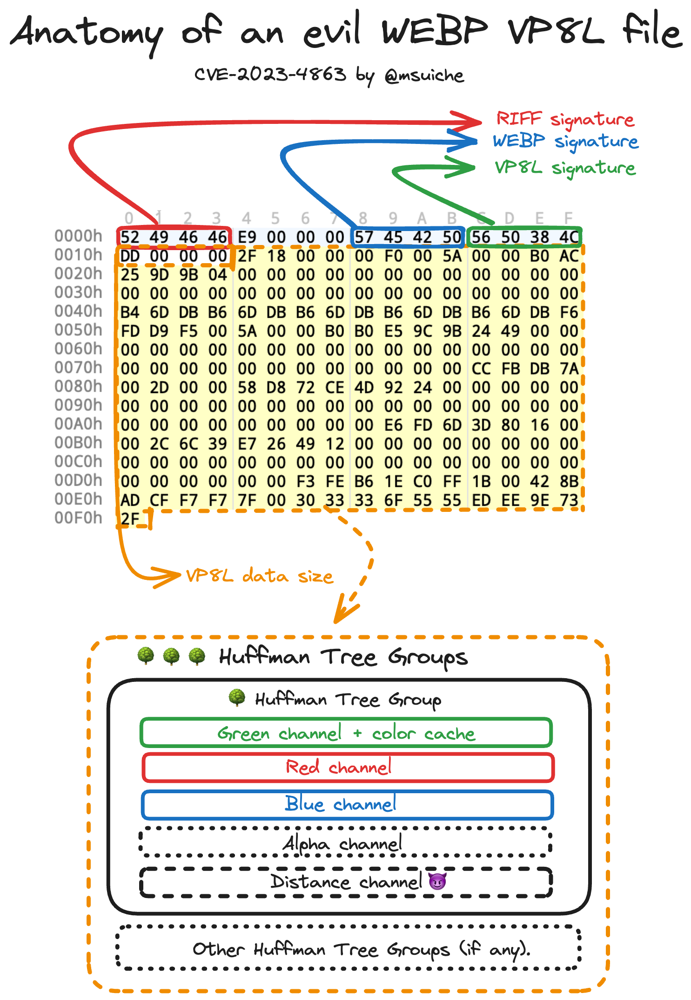

# Detecting BLASTPASS inside a WebP file.


## Introduction
The world of compression algorithms has been a realm of constant evolution and intrigue. My initial encounter with compression algorithms was in the year 2007, while reversing the Windows hibernation file to reimplement the now well-known [Microsoft LZXpress](https://github.com/MagnetForensics/rust-lzxpress) which I discovered later was used in most Microsoft products until today. This journey continues today, with the scrutiny of the vulnerability CVE-2023-4863 located within the open-source [Libwebp](https://developers.google.com/speed/webp) library, affecting Chromium-based browsers such as such Mozilla, Chrome, and Edge but also messaging applications such as iMessage.

As we delve deeper, it's imperative to contextualize the present landscape, where sophisticated attacks transcend traditional paradigms. [Brokers selling to non-NATO members](https://twitter.com/opzero_en/status/1706762507631677760) now value full-chain RCE exploits on iOS & Android at a staggering $20 million, underscoring the paramount importance of robust defense mechanisms such as detection engineering for mobile devices.

After our previous deep dive into [FORCEDENTRY exploit](https://www.magnetforensics.com/blog/researching-forcedentry-detecting-the-exploit-with-no-samples/) spread over iMessage, it’s time to focus on [BLASTPASS](https://citizenlab.ca/2023/09/blastpass-nso-group-iphone-zero-click-zero-day-exploit-captured-in-the-wild/),another alarming full-chain iOS exploit spotted in the wild by CitizenLab and addressed by Apple under CVE-2023-41064 and speculatively linked to CVE-2023-4863. A close examination reveals that unauthorized data can now be written beyond allocated memory limits, setting the stage for potential malicious activities.

There’s an evident connection with Apple's earlier CVE-2023-41064, beckoning a thorough examination and understanding of these intertwined vulnerabilities. As we peel back the layers, the “WebP 0day” bug stands out, potentially the same bug linked to the BLASTPASS vulnerability, offering an avenue for defensive research giving us the opportunity to enhance the capability detection for my previously released file-based detection [ELEGANTBOUNCER](https://github.com/msuiche/elegant-bouncer).

## File Format
### RIFF
The Resource Interchange File Format, or RIFF, operates as a universal file container format designed for storing data in tagged segments or chunks. While predominantly used for audio and video files, its flexible structure can accommodate an assortment of data types.

RIFF's inception by Microsoft and IBM in 1991 marked it as the standard format for multimedia files in Windows 3.1, influenced by the earlier Interchange File Format developed by Electronic Arts in 1985 for the Amiga platform. Over time, the RIFF format has underpinned various container formats like AVI, ANI, and WAV, demonstrating its adaptability and wide-reaching application.

Fast forward to 2010, Google unveiled the WebP image format, incorporating RIFF as its container of choice. This moment was pivotal as WebP emerged as a compelling alternative to established image formats like JPEG, PNG, and GIF, offering support for both lossy and lossless compression, alongside features such as animation and alpha transparency.
### WebP
In this exploration, our spotlight shines on the WebP format. [Google's introduction of WebP](https://www.ietf.org/id/draft-zern-webp-12.html#simple-file-format-lossless) aimed to supplant existing image formats, promising enhanced compression algorithms that ensure high-quality visuals with reduced file sizes.

RIFF's role in this format is crucial, housing the WebP data within distinct chunks, preserving the integrity and quality of the image data. This robust framework paved the way for Google's announcement of WebP in September 2010 and the subsequent release of a stable version of its supporting library in April 2018.

WebP Lossless is an image format specifically designed for the lossless compression of ARGB images. This format guarantees the accurate storage and recovery of pixel values, inclusive of the color values for pixels that have an alpha value of 0.
WebP Lossless utilizes subresolution images, which are recursively embedded within the format. These images hold crucial statistical data about the main image, including the entropy codes, spatial predictors, and color-related information such as color space conversion and color table.

The compression of the bulk data in WebP Lossless is handled through the use of LZ77, prefix coding, and a color cache. These techniques contribute to the efficiency of WebP Lossless, offering faster decoding speeds compared to PNG and a 25% improvement in compression density relative to the contemporary PNG format.
### VP8L
This section provides an overview of the compressed data representation in a WebP Lossless image. It delves into the specific components and methods that facilitate the effective compression and accurate reconstruction of images in the WebP Lossless format. This examination is fundamental for a comprehensive understanding of the internal workings and advantages of WebP Lossless image compression.

Resource Interchange File Format (RIFF) is a universal file container format that houses data in identified chunks. In the realm of the WebP image format, the RIFF encompasses multiple chunks, including the WebP chunk. However, the focal point for data extraction lies in the bitstream beneath the compression chunks, specifically VP8 (Lossy) and VP8L (Lossless compression) chunks. These chunks hold the compressed bitstream data for a single frame.

#### Bitstream Chunk Categories
The bitstream chunk might appear in two variations:

- VP8 Chunk: Identified by the tag "VP8 " (with a notable fourth-character space).
- VP8L Chunk: Identified by the tag "VP8L".

For the context of this blog post, the attention is directed solely towards the VP8L chunks.

The majority of the data within the VP8L chunk is encoded using a canonical prefix code, commonly known as Huffman coding. This encoding strategy involves the transmission of prefix code lengths, rather than the actual prefix codes themselves. A notable feature of this format is the utilization of spatially-variant prefix coding. This approach allows different image blocks to use distinct entropy codes.

The format outlines two methodologies for coding the prefix code lengths, defined by a single bit value:

- If the bit is 1: it indicates a simple code length code.
- If the bit is 0: it implies a normal code length code.
Regardless of the method employed, the format permits the presence of unused code lengths within the stream.

This discussion will center on the normal code length code. Here, the code lengths are encoded using prefix codes, necessitating an initial reading of lower-level code lengths (code_length_code_lengths).

Upon reading the code lengths, a specific prefix code is generated for each symbol type (A, R, G, B, distance) based on their respective alphabet sizes:

- G Channel: Calculated as 256 + 24 + color_cache_size
- Other Literals (A,R,B): Constant at 256
- Distance Code: Constant at 40

Five Huffman codes are used at each meta code:
1. green + length prefix codes + color cache codes
2. alpha
3. red
4. blue
5. distance prefix codes.

This computation aids in determining the alphabet size (kAlphabetSize) and, crucially, the size of the lookup tables of a Huffman tree group (kTableSize). The constant values for red, blue, alpha, and distance alphabets, and their corresponding lookup table sizes are as follows:

- Red, Blue, Alpha Alphabets: 256
- Distance Alphabet: 40
- Lookup Table Sizes: 630 and 410 respectively for worst-case scenarios.

The size of the green alphabet depends on the color cache size and is computed as 256 (green component values) + 24 (length prefix values) + color_cache_size (ranging between 0 and 2048).

For further technical insight, refer to Mark Adler’s tool for an in-depth examination of 8-bit first-level lookup values: Mark Adler's Tool.

```cpp
#define FIXED_TABLE_SIZE (630 * 3 + 410)
static const uint16_t kTableSize[12] = {
  FIXED_TABLE_SIZE + 654,
  FIXED_TABLE_SIZE + 656,
  FIXED_TABLE_SIZE + 658,
  FIXED_TABLE_SIZE + 662,
  FIXED_TABLE_SIZE + 670,
  FIXED_TABLE_SIZE + 686,
  FIXED_TABLE_SIZE + 718,
  FIXED_TABLE_SIZE + 782,
  FIXED_TABLE_SIZE + 912,
  FIXED_TABLE_SIZE + 1168,
  FIXED_TABLE_SIZE + 1680,
  FIXED_TABLE_SIZE + 2704
};
(...)
#define HUFFMAN_CODES_PER_META_CODE  5
#define NUM_LITERAL_CODES            256
#define NUM_LENGTH_CODES             24
#define NUM_DISTANCE_CODES           40

static const uint16_t kAlphabetSize[HUFFMAN_CODES_PER_META_CODE] = {
  NUM_LITERAL_CODES + NUM_LENGTH_CODES,
  NUM_LITERAL_CODES, NUM_LITERAL_CODES, NUM_LITERAL_CODES,
  NUM_DISTANCE_CODES
};
```
## The Bug

1. The overflowed Huffman Table `huffman_tables` is allocated inside `ReadHuffmanCodes()` based on two main parameters:
- The number of Huffman Tree Groups
- A fixed table size which determined as above based on the presence of `color_cache_size` (equal to zero in our example).

```cpp
  huffman_tables = (HuffmanCode*)WebPSafeMalloc(num_htree_groups * table_size,
                                                sizeof(*huffman_tables));
```
The out of bound write will occur later when reading the Huffman codes bitstream at the offset`huffman_tables + (num_htree_groups * table_size)`.

2. The overflow triggered by the lengths codes shared by [Ben Hawkes](https://blog.isosceles.com/the-webp-0day/) and [mistymntncop](https://github.com/mistymntncop/CVE-2023-4863/blob/main/print_tree.c#L22) is triggered in the parsing of the 2nd level table of the distance channel which has a maximum size of 410.

The out-of-bound write happens when calling the `ReplicateValue()` with an out-of-bound index used for `table`, within the `BuildHuffmanTable()` function.

```cpp
    idx++;
    ReplicateValue(&table[key >> root_bits], step, table_size, code);
    key = GetNextKey(key, len);
```

## Detection
The malicious distance code lengths produce an unbalanced Huffman Tree, a straight forward way to detect it is to make sure that writes are happening within the boundary of `huffman_tables` by emulating the behavior of `BuildHuffmanTable()` as we are doing via `is_code_lengths_count_valid()`.

In our code, we evaluate the length of each chanel (green, red, blue, alpha and distance) and make sure that no write is happening outside of its boundary. 

```rust
    if table_off + (key >> root_bits) + (table_size - step) >= max_table_size {
        debug!("OVERFLOW!!!!!!! (offset = 0x{:x})", table_off + (key >> root_bits) + (table_size - step));
        has_overflow = true;
    }
```

Maximum size of a given look-up table (`max_table_size`) is be determined base on two things: the `color_channel_bits` and the channel itself. In the case of the distance channel that value is 410.

```rust
    let max_table_size = match j {
        0 => K_TABLE_SIZE[color_cache_bits as usize] - FIXED_TABLE_SIZE,
        1 | 2 | 3 => MAX_RBA_TABLE_SIZE,
        4 => MAX_DISTANCE_TABLE_SIZE,
        _ => panic!("Unhandled idx value: {}", j),
    };
```

Given the design, this probably means that codes lengths of the other channels may also be used to overflow the Huffman Look-up Table which is was we ensure the boundaries of each of the channel lookup table.


## Recommendations
Ironically enough, the WebP spec did (unsurprisingly) have the following warning:
> Implementations of this format face security risks such as integer overflows, out-of-bounds reads and writes to both heap and stack

This definitely reinforce the long term value of memory safe languages such as Rust, for file parsing libraries. In the meantime, while numerous of those libraries are still written in C/C++ they are de facto bound to errors.

If you think you are at risk of such exploits, I strongly recommend you to enable (Apple's Lockdown Mode](https://support.apple.com/en-us/HT212650).

When activated, Lockdown Mode alters the functioning of various apps and features, including:

- Messages: Lockdown Mode restricts most types of message attachments, allowing only specific images, videos, and audio files. Additionally, features such as links and link previews are disabled.

- Web Browsing: The mode blocks certain advanced web technologies, potentially leading to slower loading times for some websites or rendering them inoperative. Web fonts may not be visible, and images could be substituted with a missing image icon in this mode.

This is particularly relevant as it would block the processing and pre-processing of various resources such as images, preventing such bugs to be triggered in the first place. 

## Conclusion
As we continue to explore and tackle these issues, let’s ensure to keep the conversation going, share knowledge, and collaborate towards creating a secure, resilient digital world. Stay tuned, stay secure, and let’s keep the internet safe together.

Learn more about [ELEGANTBOUNCER on GitHub](https://github.com/msuiche/elegant-bouncer).

## Acknowledgments 
I would like to thank [mistymntncop](https://github.com/mistymntncop/) for helping me understand this bug, Ben Hawkes for [his write-up and finding the code lengths](https://blog.isosceles.com/the-webp-0day/) and [Bill Marczack/CitizenLab](https://citizenlab.ca/2023/09/blastpass-nso-group-iphone-zero-click-zero-day-exploit-captured-in-the-wild/) for finding this exploit/bug.

